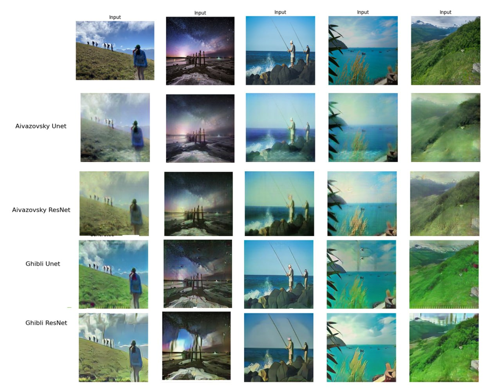

# Image-to-Image Translation using CycleGAN

> Turn real-world photographs into stylized images inspired by **Ivan
> Aivazovsky** paintings and **Studio Ghibli** movie scenes.

## Team

| Name                   | Innomail                          |
| ---------------------- | --------------------------------- |
| Apollinaria Chernikova | a.chernikova@innopolis.university |
| Egor Machnev           | e.machnev@innopolis.university    |

## About

In recent years, the field of image-to-image translation has seen remarkable
advancements, primarily driven by the development of generative adversarial
networks (GANs). Among the most influential architectures are **CycleGAN** and
**Pix2Pix**, which have enabled a wide range of applications — from style
transfer and image synthesis to domain adaptation and photo enhancement.

This project focusing on converting real-world photographs into stylized. To
evaluate the impact of model architecture on style transfer quality, four
experiments were conducted: two using Aivazovsky paintings and two using
Ghibli-style images. Each domain was tested with both a ResNet-based generator
and a U-Net-based generator. These experiments allow for a comparative analysis
of how different architectures affect the translation fidelity, texture
retention, and stylization strength.

Full details of our methodology, findings, and results can be found in the
[final report](./REPORT.pdf).
