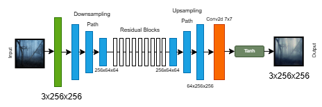
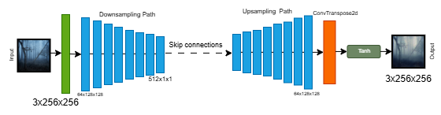
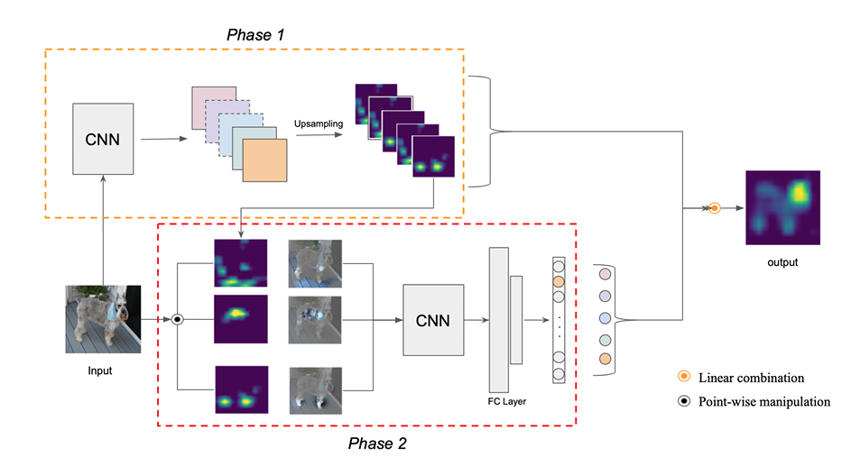

# XAI for CycleGAN: Visual Insights via Score-CAM

**XAI Course Project | Egor Machnev & Apollinaria Chernikova**

Link to the code: https://github.com/machnevegor/cyclepix
## Introduction
In recent years, the field of image-to-image translation has witnessed significant progress, largely driven by the development of generative adversarial networks (GANs).

One of the most popular architectures in this domain is CycleGAN [1], which stands out for its ability to learn mappings between domains without the need for paired datasets. 

However, like many GAN-based models, CycleGAN remains a "black box" system. Its internal decision-making processes are not clear, making it challenging to understand what features the model attends to during generation. A promising direction for addressing this limitation is to explore the interpretability of the discriminator, as it plays a crucial role in guiding the generator.

In this study, we aim to investigate the following hypothesis:
**Can the discriminator of a CycleGAN model be interpreted using the Score-CAM method?**

## Methodology
### What is CycleGAN?
The architecture of CycleGAN is built upon a GAN 
framework, consisting of two generator networks and two 
discriminator networks, designed to handle unpaired image
to-image translation between two domains, A and B. 
Each generator $G:$ $A → B$ and $F:$ $B → A$ is trained to 
translate images from one domain to another, while each 
discriminator $D_A$ and $D_B$ is trained to distinguish real images from fake images in its respective domain.

In the original CycleGAN paper, the authors propose using  ResNet-based generators, which consist of a few convolutional layers, followed by several residual blocks, and then deconvolution layers. This architecture is effective at preserving the global structure of the input image while applying stylistic changes. In this project we consider two generator implementations: 

- ResNet generator: closely follows the original CycleGAN design, using 9 residual blocks (for 256×256 images). This model excels at maintaining the content structure while translating textures and colors. 

- U-Net generator: an alternative encoder-decoder architecture with skip connections between corresponding layers in the encoder and decoder. UNet is often used in Pix2Pix and similar tasks that require fine-grained alignment between input and output, making it a strong candidate for capturing more detailed spatial relationships. 

<p align="center">
  
  <br>
  <em>Fig 1: ResNet Generator Architecture</em>
</p>

<p align="center">
  
  <br>
  <em>Fig 2: Unet Generator Architecture</em>
</p>


### Training pipeline

The dataset used in this project consists of three distinct 
parts: 500 paintings by Ivan Aivazovsky, 1,600 screenshots 
from Studio Ghibli films, and 6,287 real-world nature 
photographs.

All training experiments were conducted using the 
maximum computational resources available to us. The 
primary hardware used was the NVIDIA T4 GPU, which 
offers 15 GB of GPU memory and 29 GB of system 
memory (RAM). Due to limited hardware resources, the ResNet-based 
generator could only complete 13 epochs, preventing it from 
reaching the intended 20 epochs. This limitation is important in our study as we will analyze interpretability with information that our models could be underfitting.  

## Score-CAM for discriminator interpretation
### Why Score-CAM?
Score-CAM (Score-Weighted Class Activation Mapping) is a gradient-free visual explanation technique that generates class activation maps by directly leveraging the model’s output scores. Rather than relying on gradients — which can be noisy or undefined for non-classification outputs — Score-CAM works by

1. Extracting activation maps from a convolutional layer.
2. Upsampling and normalizing each map to match the input size.
3. Using each activation map as a mask over the input image.
4. Passing the masked image through the model and measuring the output score (in our case, the mean patch-based realism).
5. Weighting each activation map by its corresponding score and combining them to produce the final heatmap.

<p align="center">
  
  <br>
  <em>Fig 3: Score-CAM pipeline</em>
</p>

Based on the method architecture, we decieded that Score-CAM is well-suited to test our hypothesis of CycleGAN interpretability. 

First, unlike gradient-based methods such as Grad-CAM, ScoreCAM does not rely on backpropagation to compute saliency. It uses only the model’s forward-passed outputs to determine which regions of the input image are most influential for the prediction. This gradient-free nature makes ScoreCAM more robust and stable, particularly in the context of GANs

Second, Score-CAM is compatible with patch-based discriminators such as PatchGAN, which is commonly used in CycleGAN architectures. Rather than producing a single output value, PatchGAN outputs a spatial grid (e.g., a [1, 1, 30, 30] map), where each value corresponds to a patch of the image being classified as real or fake. To adapt ScoreCAM to this format, we compute the mean of the discriminator’s output map as a single representative score. 

Finally, ScoreCAM is model-agnostic and easy to implement. It does not require any changes to the model’s architecture or access to internal gradients.

### Code implementation
Here we provide the function that implementы Score-CAM method

```python
def score_cam(model, target_layer, input_tensor):
    model.eval()
    activations = []

    # Hook function to capture the output of the target layer during forward pass
    def forward_hook(module, input, output):
        activations.append(output.detach())

    # Register the forward hook on the target layer
    handle = target_layer.register_forward_hook(forward_hook)

    with torch.no_grad():
        output = model(input_tensor)

        feature_maps = activations[0][0]
        num_maps = feature_maps.shape[0]

        cam = torch.zeros(input_tensor.shape[2:], dtype=torch.float32)

        for i in range(num_maps):
            fmap = feature_maps[i]

            # Upsample the feature map to the input size
            fmap_resized = F.interpolate(
                fmap.unsqueeze(0).unsqueeze(0), 
                size=input_tensor.shape[2:], 
                mode='bilinear', 
                align_corners=False
            ).squeeze(0).squeeze(0)

            # Normalize the upsampled feature map to [0, 1]
            fmap_norm = (fmap_resized - fmap_resized.min()) / (fmap_resized.max() - fmap_resized.min() + 1e-8)

            # Multiply the normalized feature map with the input image (as a mask)
            masked_input = input_tensor * fmap_norm.unsqueeze(0)

            # Get the model's output score for the masked input
            score = model(masked_input).mean().item()

            # Accumulate the weighted feature map into the CAM
            cam += fmap_resized * score

    # Apply ReLU and normalize the final CAM to [0, 1]
    cam = F.relu(cam)
    cam = (cam - cam.min()) / (cam.max() - cam.min() + 1e-8)

    handle.remove()
    return cam.cpu().numpy()

```

## Experiments and results

As previously menioned, we have four models after training process: two models for Aivazovsky dataset and two for Ghibli dataset. For interpretation we will use discriminators that choose if the image is style or not ($D_s$). All results will be evaluated only visually because of the whole concept of CycleGAN.

### Aivazovsky dataset
For the Aivazovsky dataset we chose random real images to transfer into style and random Aivazovsky's paintings to analyze the discriminator work.

<p align="center">
  
  <br>
  <em>Fig 4: Real images in Aivazovsky style ResNet</em>
</p>

<p align="center">
  
  <br>
  <em>Fig 5: Aivazovsky's paintings ResNet</em>
</p>

<p align="center">
  
  <br>
  <em>Fig 6: Real images in Aivazovsky style Unet</em>
</p>


<p align="center">
  
  <br>
  <em>Fig 7: Aivazovsky's paintins Unet</em>
</p>


We intentionally selected a variety of input images to better demonstrate how both the CycleGAN model and the interpretability method perform in different situations.

While working with the model, we discovered an additional limitation: the Aivazovsky-style generator does not work well with images that lack elements typical of the artist’s paintings. For example, snowy landscapes or nighttime scenes are usually translated poorly.

On the other hand, images that contain open skies and water — which are common themes in Aivazovsky’s art — are processed much better. To explore this observation further, we also tested the model on a few randomly chosen photos that include these kinds of landscapes.


<p align="center">
  
  <br>
  <em>Fig 8: Real sea images in Aivazovsky style ResNet</em>
</p>

<p align="center">
  
  <br>
  <em>Fig 8: Real sea images in Aivazovsky style Unet</em>
</p>

When comparing the two discriminator architectures, we observe that the U-Net-based discriminator tends to focus on more localized and fine-grained elements, whereas the ResNet-based discriminator attends to broader regions of the image. On randomly selected inputs, the two models highlight completely different areas, suggesting inconsistencies in what each model considers important. We hypothesize that this behavior may be partially due to undertraining. With extended training, it is likely that both models would learn to attend to more structured and semantically meaningful regions.

Despite these differences, we consistently observe that both discriminators tend to focus on visually distinctive features such as ships, waves, sky, coastlines, and cliffs — elements commonly found in Aivazovsky’s paintings.

While it is still difficult to draw definitive conclusions about the overall effectiveness of the models within the current dataset, we find that interpretability becomes more meaningful when we know what features to look for. This suggests that combining model interpretation with domain knowledge can improve our understanding of model behavior.

### Ghinli dataset

The same procedure for the ghibli dataset.


<p align="center">
  
  <br>
  <em>Fig 9: Real images in Ghibli style ResNet</em>
</p>

<p align="center">
  
  <br>
  <em>Fig 10: Real Ghibli anime image ResNet</em>
</p>


<p align="center">
  
  <br>
  <em>Fig 11: Real images in Ghibli style Unet</em>
</p>

<p align="center">
  
  <br>
  <em>Fig 12: Real Ghibli anime image Unet</em>
</p>

A similar pattern can be observed here: the U-Net-based discriminator focuses on smaller, more detailed objects, while the ResNet-based model attends to broader, more general regions of the image.Additionally, since this dataset does not contain clear stylistic elements such as ships or the sea — which are common in Aivazovsky’s work — both models seem to shift their attention toward the way lines and textures are drawn rather than specific objects. This is especially noticeable on real images, where large portions of the heatmap highlight the painterly style of lines, brushstrokes, and textures. These areas are often marked in red, indicating that the discriminator considers them highly relevant when making its decision.

## Conclusion

In conclusion, we are generally satisfied with the results obtained in this study. While there are many aspects in which the models could still be improved — including further training, dataset refinement, and architectural tuning — the baseline models already demonstrate reasonable performance.

Most importantly, we have shown that Score-CAM can be effectively used as an interpretability method for the discriminator in CycleGAN. Given that interpretability methods for generative adversarial networks, and especially for discriminators, are still relatively scarce, this approach proves to be a promising and practical solution. Our findings suggest that Score-CAM offers meaningful visual explanations, highlighting areas that contribute most to the discriminator's decision-making process, and helping us better understand what these models actually learn.
